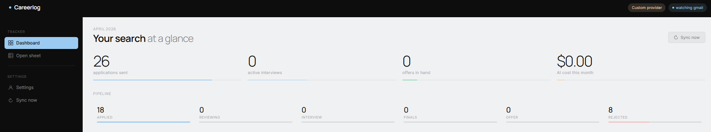
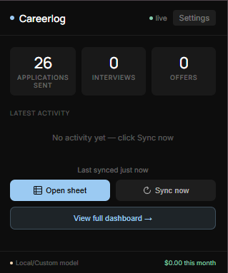

# Careerlog

Careerlog automatically tracks job applications from Gmail into Google Sheets.

You connect your account once, pick your AI provider, and your pipeline stays updated without manual copy-paste.

No backend. No monthly platform dependency. Your data remains in your Google account.

This extension is free to use.

---

## Product Preview

<p align="center">
  
</p>
<p align="center">
  
</p>

---

## The Product

Job searching breaks when tracking is manual.

Careerlog fixes that by turning inbox updates into a clean application pipeline:

- Application confirmations become new tracker rows.
- Interview/rejection/offer updates modify existing records.
- Dashboard and popup show progress, status, and activity.

This project is built to be sold by you as a direct product for job seekers who want automation with privacy.

---

## Why Users Will Pay For This

- Saves time daily: no repeated spreadsheet admin.
- Reduces mistakes: fewer missed status updates.
- Gives visibility: one place to monitor interviews and offers.
- Feels trustworthy: user controls inbox, sheet, and API keys.
- Works with budget: Gemini free tier, paid cloud models, or local models.

Simple value proposition:

"Stop managing your tracker. Let your inbox update it for you."

---

## Core Features

- Gmail to Sheets automation with structured parsing.
- Initial sync (15 or 30 days) plus ongoing catch-up sync.
- Multi-provider AI support:
  - Gemini
  - Claude
  - OpenAI
  - Custom OpenAI-compatible endpoints
  - Ollama local models
- Privacy-first architecture (no project backend).
- Setup wizard with 4-step onboarding.
- Settings panel with diagnostics, sync controls, and provider verification.
- Dashboard with funnel view, stats, and activity feed.

---

## How It Works

### Initial Setup

1. User selects AI provider.
2. User adds API key (optional for local/custom setups).
3. User connects Google account.
4. Extension creates the tracker sheet (`Applications` + `Interview Log`).
5. Initial sync parses recent job emails and writes structured records.

### Ongoing Sync

- Polling alarm runs every 5 minutes.
- Catch-up runs on Chrome startup and window focus.
- Gmail history API provides incremental updates.
- If history window expires, fallback scan covers recent inbox history.

### Sheet Update Logic

- Matches existing records by job URL first, then company/role.
- Handles update-only emails without creating unnecessary duplicates.
- Writes status, round progression, notes, and interview log entries.

---

## Privacy And Security

- No app-owned backend receives Gmail content.
- OAuth handled by Chrome Identity API.
- Data is stored in user-owned Google Sheets.
- Local state uses `chrome.storage.local`.
- Custom provider URLs are validated (`https://` or localhost HTTP).
- AI responses are checked before write operations.

If privacy is your marketing wedge, this section is your strongest advantage.

---

## Quick Start

### 1. Configure Google OAuth

1. Open Google Cloud Console.
2. Create/select project.
3. Enable APIs:
   - Gmail API
   - Google Sheets API
4. Create OAuth 2.0 Client ID of type Chrome Extension.
5. Add extension ID from `chrome://extensions`.
6. Put the client ID in `manifest.json` under `oauth2.client_id`.

Important: placeholder OAuth IDs will fail auth.

### 2. Generate Icons (Optional)

```bash
pip install pillow
python scripts/generate_icons.py
```

### 3. Load Extension

1. Open `chrome://extensions`.
2. Enable Developer mode.
3. Unizip this Repository and Click Load unpacked.
4. Select this project folder.

### 4. Complete Onboarding

1. Click extension icon.
2. Click Get started.
3. Choose provider and key.
4. Connect Google.
5. Select sync range and run first sync.

---

## AI Provider Setup

| Provider | Cost Profile | Get Key |
|---|---|---|
| Gemini | Free tier available | https://aistudio.google.com/app/apikey |
| Claude | Paid usage | https://console.anthropic.com/keys |
| OpenAI | Paid usage | https://platform.openai.com/api-keys |
| Ollama (local) | Local compute | No cloud key required |

Local setup example:

- Provider: Custom / Local Model
- Custom API Type: Ollama
- Base URL: http://localhost:11434
- Model: llama3
- API key: optional

---

## Product Surfaces

- Popup: quick stats, sync-now, open sheet/dashboard.
- Onboarding: guided setup with validation.
- Dashboard: pipeline funnel, application cards, activity feed.
- Settings: provider config, diagnostics, reconnect/sign-out, manual sync actions.

---

## Project Structure

```text
Job-Tracker/
|- manifest.json
|- background.js
|- lib/
|  |- auth.js
|  |- gmail.js
|  |- filter.js
|  |- ai.js
|  |- sheets.js
|- popup/
|  |- popup.html
|  |- popup.js
|- onboarding/
|  |- onboarding.html
|  |- onboarding.js
|- dashboard/
|  |- dashboard.html
|  |- dashboard.js
|- settings/
|  |- settings.html
|  |- settings.js
|- styles/
|  |- tokens.css
|  |- popup.css
|  |- onboarding.css
|  |- dashboard.css
|- scripts/
|  |- generate_icons.py
```

---

## Reliability Notes

- `totalProcessed` counts parsed sync events, not total applications in sheet.
- Applied date uses parsed date, then source email date, and avoids fake dates for update events.
- Gmail history expiration is handled with fallback scanning.
- Duplicate control is improved by job URL matching before fuzzy company/role matching.

---

## Troubleshooting

Sync not running:

- Inspect service worker logs from `chrome://extensions`.
- Check API key/provider config in Settings.
- Trigger Sync now from popup/dashboard/settings.

Google auth issues:

- Verify real OAuth client ID in `manifest.json`.
- Reconnect Google in Settings.

Sheet errors:

- Confirm sheet still exists and account has access.
- Check diagnostics section for latest error and timestamp.

Low detection quality:

- Review Gmail patterns and ATS domain coverage.
- Run manual sync after recent application activity.

---

## Positioning You Can Use Publicly

Careerlog is the automated tracker for job seekers who want results without giving up data ownership.

Short version:

"Your inbox already knows your job search. Careerlog turns it into a live tracker."

---

## Bug Reports And Contact

Found a bug or unexpected behavior?

- Open an issue in this repository via the Issues tab.
- Or email me directly: chamola31@gmail.com

If you email, include:

- what happened
- steps to reproduce
- screenshots or console error logs (if available)
